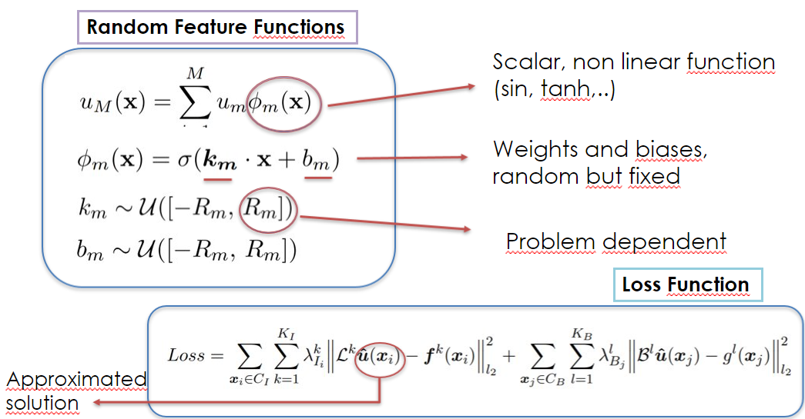
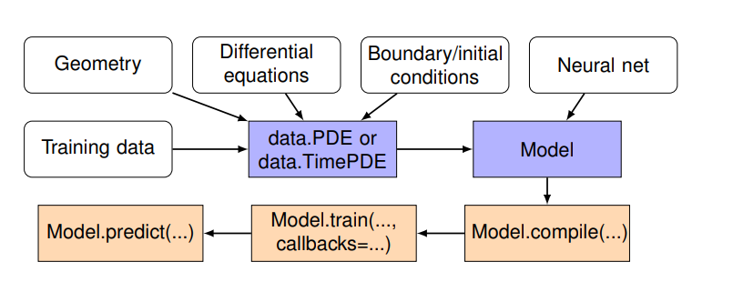

# raNNdom

[raNNdom](https://github.com/ZIB012/raNNdom) is a library for scientific machine learning based on the [DeepXDE](https://github.com/lululxvi/deepxde.git) library

It includes the possiblity to solve different problems using the Random Feature Method, applied to physiscs-informed neural network.



Some problems that can be solved with this method are:
- forward/inverse ordinary/partial differential equations
- forward/inverse integro-differential equations
- fPINN: forward/inverse fractional PDEs

In the folder [examples](examples/) you can find how to use the library, along with the code related to the numerical results presented [here](report.pdf)

The library supports five tensor libraries as backends: TensorFlow 1.x, TensorFlow 2.x, PyTorch, JAX, and PaddlePaddle. 

While the Random Feature Method is supported only by Tensorflow 2.x
##
## Features
- complex domain geometries: The primitive geometries are interval, triangle, rectangle, polygon, disk, ellipse, star-shaped, cuboid, sphere, hypercube, and hypersphere. Other geometries can be constructed as constructive solid geometry (CSG) using three boolean operations: union, difference, and intersection. It also supports a geometry represented by a point cloud.
- 5 types of boundary conditions (BCs): Dirichlet, Neumann, Robin, periodic, and a general BC, which can be defined on an arbitrary domain or on a point set
- different neural networks: fully connected neural network (FNN); random fully connected neural network (random_FNN), which implements the Random Feature neural network using the same structure of FNN; 
random feature with partition of unity method (partition_random_FNN), which is a neural network where the Partition of Unity method is combined with the Random Feature Method.
- many sampling methods: uniform, pseudorandom, Latin hypercube sampling, Halton sequence, Hammersley sequence, and Sobol sequence. The training points can keep the same during training or be resampled (adaptively) every certain iterations.
- different optimizers: Adam, L-BFGS, etc.
- callbacks to monitor the internal states and statistics of the model during training: early stopping, etc.


##
## Installation
Clone the [raNNdom](https://github.com/ZIB012/raNNdom) GitHub repository:

```
git clone https://github.com/ZIB012/raNNdom.git
```

The library requires one of the following backend-specific dependencies to be installed:

- TensorFlow 1.x: [TensorFlow](https://www.tensorflow.org)>=2.7.0
- TensorFlow 2.x: [TensorFlow](https://www.tensorflow.org)>=2.2.0, [TensorFlow Probability](https://www.tensorflow.org/probability)>=0.10.0
- PyTorch: [PyTorch](https://pytorch.org)>=1.9.0
- JAX: [JAX](https://jax.readthedocs.io), [Flax](https://flax.readthedocs.io), [Optax](https://optax.readthedocs.io)
- PaddlePaddle: [PaddlePaddle](https://www.paddlepaddle.org.cn/en) ([develop version](https://www.paddlepaddle.org.cn/en/install/quick?docurl=/documentation/docs/en/develop/install/pip/linux-pip_en.html))

### 1. Anaconda setup (Recommended)
In order to work with the library, it's suggested to use anaconda and create a new conda environment in which downloading all the dependencies needed:
```
conda create --name random

conda activate random
```
#### 1.1 Automatic installation with requirements.txt (supported: windows 64)
In the anaconda terminal, go to the library repository, and then install all the dependencies ones using:
```
conda install --force-reinstall -y -q --name random -c conda-forge --file requirements.txt
```

#### 1.2 Manual installation
Install in the conda environment the tensor backend you want to use. 

Our Random Feature Method is supported by TensorFlow 2.x: [TensorFlow](https://www.tensorflow.org)>=2.2.0, [TensorFlow Probability](https://www.tensorflow.org/probability)>=0.10.0

```
conda install -c conda-forge tensorflow
conda install -c conda-forge tensorflow-probability
```

Install in the conda environment the basic python libraries needed to run the repository examples:
- [Matplotlib](https://matplotlib.org/)
- [NumPy](https://numpy.org/install/)
- [scikit-learn](https://scikit-learn.org/stable/)
- [scikit-optimize](https://github.com/scikit-optimize/scikit-optimize.git)
- [SciPy](https://scipy.org/)

```
conda install -c conda-forge matplotlib
conda install -c anaconda numpy
conda install -c anaconda scikit-learn
conda install -c conda-forge scikit-optimize
conda install -c anaconda scipy
```

## 2. Pip setup
If you prefer to use pip to install the packages and run the repository:

```
pip install tensorflow
pip install tensorflow-probability

pip install numpy
pip install matplotlib
pip install scikit-learn
pip install scikit-optimize
pip install scipy
```

## 


