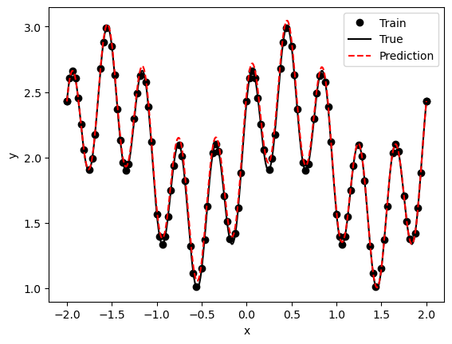
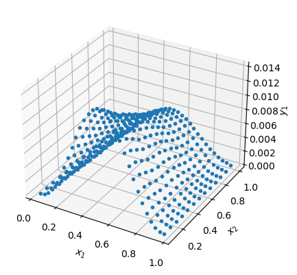
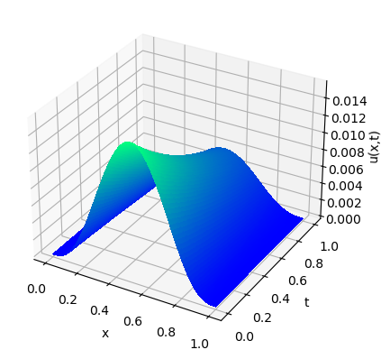

# Numerical Results

Here you can find the code related to all the numerical results presented in our [report](../report.pdf) and more.

## Parameters
The main parameters we focused on:
- $M =$ it's the hidden layer dimension; so it's the number of random basis function we are considering
- $k_m,\, b_m =$ they are the random but fixed weights and biases representing the activation function of the hidden layer. They are usually sampled from a uniform distribution.
- $R_m = $ it's the coefficient that describes the domain of the uniform distributions from which $k_m$ and $b_m$ are sampled
#
## Helmhotz.py
$
\begin{cases}
            -\frac{d^2u(x)}{dx^2} + u(x) = f(x) & x \in \,\Omega \\
            u(-1) = c_1,\;\;\; u(1) = c_2
        \end{cases}
$

The explicit form of the solution u is assumed to be $u(x) = 0.5\,x^5 + 1.3\,x^4 - 2.7\,x^3 - 5.5\,x^2 + 2.7\,x + 2.3$

In this problem we set the hyperparameters as follows:
- $M = 100$
- number of training points $n_p = 40$
- $R_m = 10$
- weights $k_m \sim  \mathcal{U}([-R_{m},\,R_{m}])$
- biases $b_m \sim  \mathcal{U}([-R_{m},\,R_{m}])$

#
## partition_of_unity.py
We consider a 1D poisson equation, on which we applied our partition of unity method

$
\begin{cases}
            -\frac{d^2u(x)}{dx^2} = f(x) & x \in \,\Omega \\
            u(-1) = c_1,\;\;\; u(1) = c_2
\end{cases}
$

The explicit form of the solution u is assumed to be $u(x) = sin(3\,\pi\,x + \frac{3\,\pi}{20})*cos(2\,\pi\,x + \frac{\pi}{20}) + 2$

In this problem we set the hyperparameters as follow:
- number of partition N = 4
- $M = \frac{1200}{N}$
- number of training points $n_p = 120$
- $R_m = 20$
- weights $k_m \sim  \mathcal{U}([-R_{m},\,R_{m}])$
- biases $b_m \sim  \mathcal{U}([-\frac{R_{m}}{10},\,\frac{R_{m}}{10}])$

#
## Fractional.py
We consider the time-dependent, one-dimensional fractional Poisson equation, defined over the domain $\Omega = [0,\,1]\times[0,\,1]$

$
        \begin{cases}
            \frac{\partial\,u(x,\,t)}{\partial\,t} + (-\Delta)^{\frac{\alpha}{2}}u(x,\,t) = f(x,\,t) & \forall\,(x,\,t) \in \Omega \\
            u(0,\,t) = u(1,\,t) = 0 & \forall \,t \in [0,\,1] \\
            u(x,\,0) = x^3(1-x)^3 & \forall \, x \in [0,\,1] 
        \end{cases}
    $

The explicit form of the solution $u$ is $u(x,\,t) = e^{-t}\,x^3\,(1-x^3)$, while the parameter $\alpha$ is taken as $\alpha = 1.8$

In this problem, we set the hyperparameters as follows:
- $M = 50$
- $R_m = 4$
- number of training points $n_p = 50$
- weights $k_m \sim  \mathcal{U}([-R_{m},\,R_{m}])$
- biases $b_m \sim  \mathcal{U}([\frac{-R_{m}}{10},\,\frac{R_{m}}{10}])$

 
Approximated solution

Exact solution
#
## Poisson_2D_Lshaped.py
Consider the two-dimensional Poisson equation with Dirichlet boundary conditions over an L-shaped domain $\Omega$, defined by its vertices: $[0, 0], \,[1, 0], \,[1, -1], \,[-1, -1], \,[-1, 1], \,[0, 1]$

$
        \begin{cases}
            -\Delta\,u(x,\,y) = 1 & (x,\,y)\in\,\Omega \\
            u(x,\,y) = 0 & (x,\,y) \in \,\partial\Omega
        \end{cases}
$

The explicit form of the solution $u(x,\,y)$ is not given.

In this problem we set the hyperparameters as follows:
- $M = 100$
- Number of training points $n_p = 1200$ or $n_p = 1000 + 15\,M$
- $R_m = 10$.
- weights $k_m \sim \mathcal{U}([-R_{m},\,R_{m}])$
- biases $b_m \sim \mathcal{U}([-R_{m},\,R_{m}])$